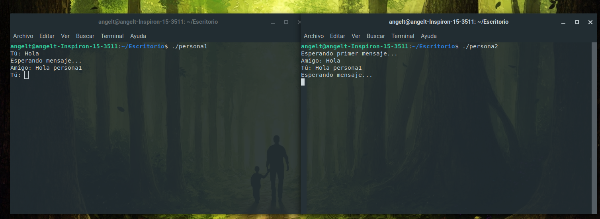

# Actividad 4 - Chat Basico con Named Pipes
Angel David Torcelli Barrios - 201801169

---

Para el chat se crearon dos scripts los cuales corresponden a cada participante.
## Creación de los scripts
### Participante 1
```bash
#!/bin/bash

# Definir el nombre de pipe
PIPE=prueba_chat

# Crear el pipe si no existe
if [[ ! -p $PIPE ]]; then
    mkfifo $PIPE
fi

# Bucle para enviar y recibir mensajes
while true; do
    read -p "Tú: " mensaje
    echo "$mensaje" > $PIPE
    echo "Esperando mensaje..."
    # Leer el mensaje del receptor
    receptor_message=$(cat $PIPE)
    echo "Amigo: $receptor_message"
done
``` 

### Participante 2

```bash
#!/bin/bash

# Definir el nombre de pipe
PIPE=prueba_chat

# Crear el pipe si no existe
if [[ ! -p $PIPE ]]; then
    mkfifo $PIPE
fi

# Bucle para enviar y recibir mensajes
echo "Esperando primer mensaje..."
while true; do
    # Leer el mensaje del emisor
    emisor_message=$(cat $PIPE)
    echo "Amigo: $emisor_message"

    read -p "Tú: " mensaje
    echo "Esperando mensaje..."
    echo "$mensaje" > $PIPE
done
``` 
## Dar permisos de ejecución
En este caso los archivos con los script se llamaban persona1 y persona2.
```bash
chmod +x persona1 persona2
``` 

## Ejecución de los script
Se debe ejecutar cada archivo en una terminal diferente. Abriendo una terminal en la ruta del script ejecutarlo de la siguiente manera:
```bash
./persona1
``` 
```bash
./persona2
``` 
## Funcionamiento

