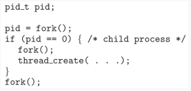

# Actividad 5 - Prueba de Procesos e hilos
Angel David Torcelli Barrios - 201801169

---

Usando el siguiente código como referencia, completar el programa para que sea ejecutable y responder las siguientes preguntas:

a)¿Cuántos procesos únicos son creados?
b)¿Cuántos hilos únicos son creados?



### Código ejecutable:
```c
#include <stdio.h>
#include <pthread.h>
#include <unistd.h>

void *thread_function(void *arg) {
    printf("Hilo creado en proceso: %d\n", getpid());
    return NULL;
}

int main() {
    pid_t pid;

    pid = fork();
    if (pid == 0) { // Proceso hijo
        fork(); // Segunda bifurcación en el proceso hijo
        pthread_t thread;
        pthread_create(&thread, NULL, thread_function, NULL); // Crear un hilo en el proceso hijo
        pthread_join(thread, NULL); // Esperar a que el hilo termine
    }

    fork(); // Tercera bifurcación, en proceso padre
    return 0;
}
``` 

### Respuestas
**a)¿Cuántos procesos únicos son creados?**
Se crean un total de seis procesos únicos. Esto incluye el original y los generados por las tres llamadas a fork(). El proceso original y el proceso hijo de la primera bifurcación se dividen en dos cada uno en la segunda bifurcación. Luego, en la tercera bifurcación, los tres procesos ejecutan la llamada a fork(), generando en total seis procesos únicos.

**b)¿Cuántos hilos únicos son creados?**
Se crean un total de dos hilos únicos. Esto se debe a que la función thread_create() se llama dos veces dentro del bloque if, generando dos hilos. Aunque hay múltiples llamadas a pthread_create(), los hilos creados no avanzan a la última llamada a fork() debido a que esperan a que su proceso hijo termine con pthread_join(). Por lo tanto la respuesta más precisa sería seis procesos y **ocho hilos** en total, considerando dos hilos por llamada a thread_create() y seis hilos correspondientes a los seis procesos iniciales de un solo hilo.

